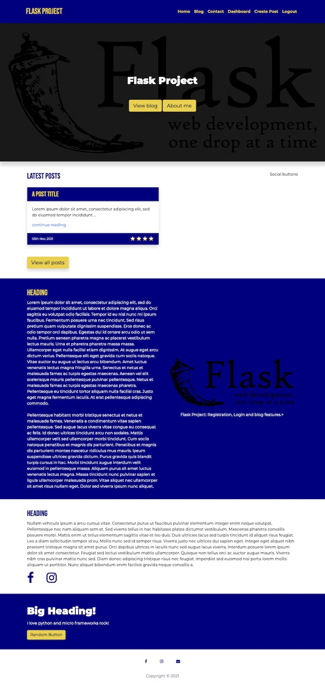
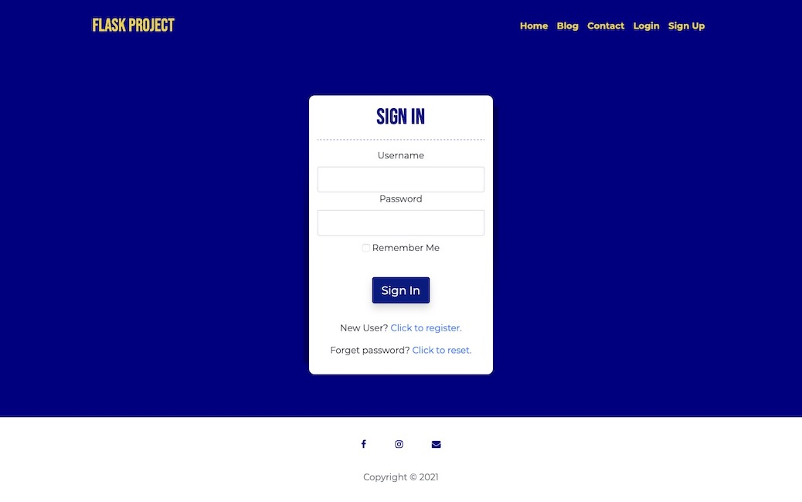
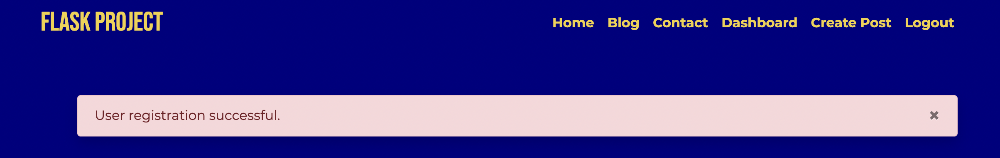
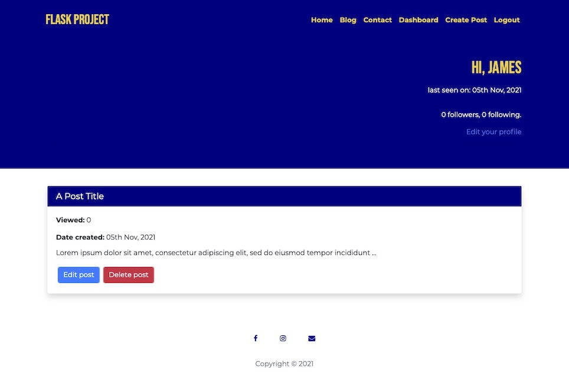
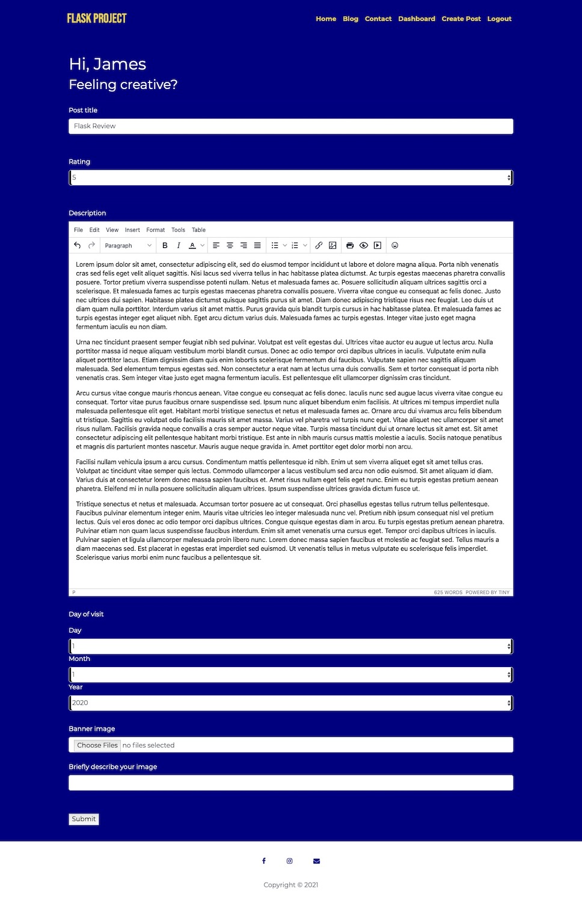
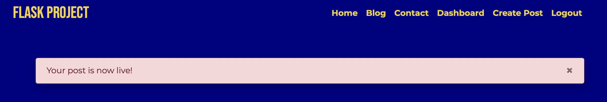

# Flask-WebApp
Web app written in Python using the Flask framework.

## Features
SQL Database.  
Configuration file reads from .env for easy setup and management.  
Logging and log rotation.  
User registration, login and password reset using JSON Web Tokens.  
Password hashing.  
Blog.  
Dashboard for post management (edit & delete).  
TinyMCE editor.  
Clean and sanitise users HTML input.  
Compress and validate user image uploads.  
SEO Slugs.

## Installation
Download repo and create virtual environment.

python -m venv venv
source venv/bin/activate
export FLASK_APP=blog.py

Init database and create migrations.

flask db init
flask db migrate

TODO: Edit migration script

flask db upgrade
flask run

## Screenshots

### Homepage

### Registration/Login

### Dashboard

### Blog editor

